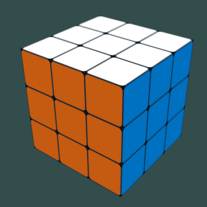
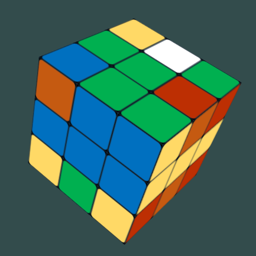
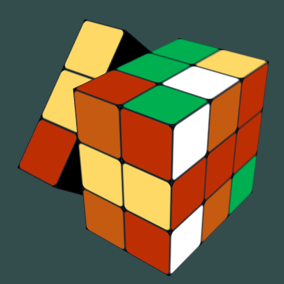
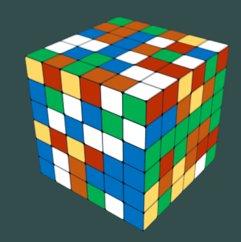

Magic Cube Project Report
=========================

## Overview

本项目实现了一个简单的魔方，支持用户：

+ 用鼠标滚轮对魔方进行放大、缩小
+ 对魔方的整体或某个层次进行旋转。点选魔方的某个层次并沿特定方向移动鼠标实现层次的旋转，点选魔方外的背景移动鼠标实现整体的旋转
+ 切换魔方的阶数，目前支持 2 ~ 6 阶的魔方，可通过键盘数字 2 ~ 6 选择对应阶的魔方
+ 选择灯光，目前支持没有灯光、简单的环境光加散射光，以及颜色不断变化的灯光。通过键盘 X, Y, Z 进行选择

最终实现的效果如下图所示:

<table>
<tr>
    <td></td>
    <td></td>
</tr>
<tr>
    <td></td>
    <td></td>
</tr>
</table>

针对魔方操作的演示，您可以查看本项目下的 `magic-cube.mp4` 文件。

### 如何获取本项目

本项目目录下包含以下若干子目录：

+ `.vscode` 目录。其中包含运行本项目所必须的配置文件，如 tasks.json
+ `images` 目录。其中包含了魔方六个面所使用的贴图
+ `include` 目录。其中包含了本项目依赖的若干开源项目，例如 `glm`, `stb_image` 等。作者实现的若干库文件也包含在其中，例如 `camera.h` 实现了相机的相关操作，`ray.h` 则实现了光线的相关操作，`cube.h` 实现了一个基础的立方体类，可以支持对各个面进行贴图，指定立方体旋转的角度和方向，计算光线与立方体相交的位置等。实现方面的细节在后文还会详细讨论
+ `lib` 目录。其中包含了本项目依赖的若干静态链接库
+ `shader` 目录。其中包含了作者实现的顶点着色器 `vertex.glsl` 和面片着色器 `fragment.glsl`。
+ `src` 目录。其中包含了 `glad.c` 以及本项目的入口文件 `main.cpp`
+ `glfw3.dll` 为本项目依赖的动态链接库
+ `README.md` 为本说明文件

您可以直接使用 `git clone` 命令获取本项目：

```bash
git clone git@github.com:xUhEngwAng/magic-cube.git
```

为了运行本项目，您可以直接在 Windows 机器上运行 `main.exe`。如果您希望从源码编译本项目，则需要进行相关环境的配置，这涉及安装 mingw 编译器，配置项目的 `include` 和 `lib` 路径等。运行环境的配置可以参考 [这篇文章](https://medium.com/@vivekjha92/setup-opengl-with-vs-code-82852c653c43)。如果您使用非 Windows 环境，建议您从互联网上寻找对应环境的配置资料。

## 实现细节

### 相关数据结构设计

魔方需要支持的基本操作包括全局旋转和局部旋转，其中局部旋转的基本单位为某一个层次。然而，魔方的基本单元并不适合用一个层次来表示 —— 因为一个立方体有可能同时属于多个层次（至多三个），即 X, Y, Z 各一个方向的层次，该立方体在这三个层次上均可以进行转动 —— 以层次为魔方的基本单位将限制魔方在各个方向的转动。因此，在基本数据结构方面，作者选择每一个立方体为魔方的基本单位，无论是全局旋转还是局部旋转都以立方体为基本单位。

设魔方的阶数为 `r`，则魔方一共包含 `r^3` 个立方体，这些立方体的位置以及贴图信息都是不同的。因此，每个立方体除了要保存立方体中各个定点的坐标、法向量以外，还需要保存立方体各个面的贴图以及当前的位置信息，后者的形式乃是一个模型变换矩阵 `model matrix`。

### 魔方的局部和全局旋转

要实现魔方的全局旋转是相对简单的，确定旋转的方向和角度后，针对每一个立方体都进行同样的旋转变换即可。局部旋转则需要一些设计。由于魔方只是保存了各个立方体的集合，其本身并不知道各个立方体当前的位置，指定了旋转的层次、方向和角度后，需要对每个立方体逐个进行判断，确定该立方体是否应该被旋转。这部分逻辑相对比较复杂，例如如果要绕 Y 轴旋转第二层，需要逐个判断各个立方体中心的 Y 轴坐标是否对应了第二层；而如果要绕 X 轴旋转第三层，则需要判断立方体的 X 轴坐标。关于这些逻辑的实现细节，读者可以参看 `magic_cube.h` 中的 `cube_qualified` 方法。

```cpp
bool cube_qualified(int cube_ix, const RotateState state, const RotateLayer layer){
    if(state == ROTATE_NONE) return false;
    if(layer == LAYER_ALL) return true;

    float cube_length = length / rank;
    float layer_center = (0.5 + static_cast<int>(layer)) * cube_length;

    bool qualified;
    switch(state){
        case ROTATE_X:
            qualified = fabs(cubes[cube_ix].getCenter().x - layer_center) < 1e-5f;
        break;
        case ROTATE_Y:
            qualified = fabs(cubes[cube_ix].getCenter().y - layer_center) < 1e-5f;
        break;
        case ROTATE_Z:
            qualified = fabs(cubes[cube_ix].getCenter().z + layer_center) < 1e-5f;
        break;
        default:
        break;
    }
    return qualified;
}
```

### 用户交互的设计

本项目中最为复杂的一环当属用户交互的设计。由于同时要实现整体和局部的旋转，用户点选魔方某一层时需要进行局部旋转，整体的旋转只有放在用户点选魔方的背景上时进行。

首先需要解决的一个问题是，如何知道用户是选择了背景还是魔方，如果是后者，如果知道用户选中了哪一个面，选中的这个面的第几层，旋转的方向是什么方向。针对这一问题，作者是实现了简单的类似于光线跟踪的算法，即当用户点击屏幕时，可以获取用户当前点击的像素坐标，并将其转化为全局坐标系中相机的 `near` 平面上的一个坐标，这部分是由 `camara.h` 中的 `Camera` 类实现的。用户的点击行为可以被抽象为从相机的位置向上述 `near` 平面的坐标射出一条光线，判断用户点击的位置即等价为光线在世界坐标系中是否与魔方相交，与魔方的哪一个立方体相交。立方体与光线相交的算法实现在了 `cube.h` 中的 `Cube` 类，其原理为依次判断光线与立方体各个表面是否相交 —— 首先计算直线与平面的交点，然后判断该交点是否在立方体表面内部 —— 然后返回最近的相交点作为最终的结果。

```cpp
bool hit(const Ray& ray, double t_min, double t_max, HitRecord& rec){
    bool ishit = false;
    float dn, t;
    glm::vec3 hit_point, norm;

    for(int ix = 0; ix != 6; ++ix){
        Triangle tri(vertices[6*ix].first, 
                        vertices[6*ix+1].first, 
                        vertices[6*ix+2].first);
        tri.transform(model);
        norm = glm::normalize(glm::cross(tri.y-tri.x, tri.z-tri.x));
        dn = glm::dot(ray.direction, norm);
        if(fabs(dn) < 1e-5) continue;
        t = glm::dot((tri.x - ray.origin), norm) / dn;
        if(t < t_min || t_max < t) continue;
        hit_point = ray.at(t);
        if(!tri.inside(hit_point)){
            tri = Triangle(vertices[6*ix+3].first, vertices[6*ix+4].first, vertices[6*ix+5].first);
            tri.transform(model);
            if(!tri.inside(hit_point)) continue;
        }
        ishit = true;
        t_max = t;
        rec.t = t;
        rec.p = hit_point;
    }

    return ishit;
}
```

确定了光线与魔方的交点后，即可获得该交点所处的表面，接下来立方体可以绕与该表面垂直的两个方向进行局部旋转。通过记录鼠标移动的方向，可以计算出在两个可能的旋转方向上的分量，选择分量绝对值更大的那个方向作为实际的旋转方向。确定了旋转方向后，才能计算旋转的层次，这是通过判断交点在该旋转方向上的坐标值来实现的。总而言之，局部旋转各要素的判定依照 交点 --> 交点的表面 --> 旋转的方向 --> 旋转的层次 的流程。这部分的实现细节可以参考 `main.cpp` 中的 `local_rotate` 方法，全局旋转的实现也是类似，只不过判断逻辑更简单一些，其实现细节参见 `main.cpp` 中的 `global_rotate` 方法。

### 其它

在魔方的实现中还有很多其它细节，例如为了让用户体验更加平滑，当用户拖拽鼠标进行局部旋转时，对应的层次要随着用户鼠标位置的移动而转动。用户放开鼠标时，当前旋转的角度未必恰好将魔方复位（即 90° 的倍数），此时需要通过程序处理，将旋转的角度调整至最近的 90° 的倍数。

```cpp
if(action == GLFW_RELEASE){
    mouse_pressed = false;
    int num_rotates = rotate_angle / 90.0;
    if(fabs(rotate_angle - 90.0 * num_rotates) > 45.0){
        if(rotate_angle < 0) num_rotates -= 1;
        else num_rotates += 1;
    }
    magicCube.rotate(rotate_state, rotate_layer, num_rotates * 90.0f);
    rotate_angle = 0;
    rotate_state = ROTATE_NONE;
}
```

此外，还有多阶魔方的支持，则需要 `MagicCube` 类实现的更加灵活，可以根据魔方的阶数调整各个立方体的位置以及光线相交时层次坐标的判断，这部分也不再赘述。针对光照效果的支持不再详述了，需要注意的是光照效果中并没有实现镜面反射（specular) 的效果，因为魔方表面出现镜面反射可能会给用户带来视觉上的不便。

## 许可

本项目中由贡献者编写的文件在不做特殊说明的情况下使用 [MIT LICENSE](LICENSE) 开源。这意味着您可以任意使用、拷贝、修改、出版以及将本项目用于商业用途，但是在所有基于本项目的拷贝及其衍生品中都必须包含此开源许可证。

其余部分的版权归属各自的作者。
